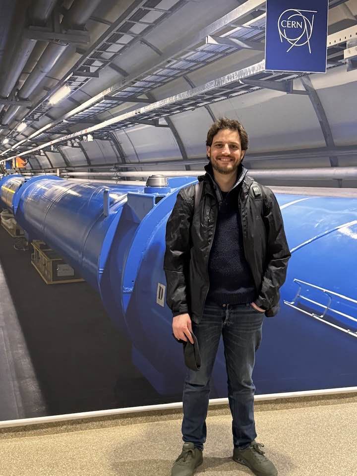

# Cristian Joana's Homepage

---

\\
 
<!--  width="360" height="480 -->

\\
Welcome to **Cristian Joana**'s homepage. 

\\
I am a post-doctoral researcher interested in numerical relativity and cosmology. I am affiliated the Institute of Theoretical Physics, Chinese Academy of Science (ITP-CAS), located in Beijing.

\\
In my work I use numerical tools like numerical relativity simulations to study and test different models and phenomena of the early Universe. During my PhD, I focused on the initial conditions problem for cosmic inflation (see [paper](https://arxiv.org/abs/2011.12190) and [post](https://cjoana.github.io/cosmo/preinflation)), as well the process of preheating (see [paper](https://arxiv.org/abs/2202.07604) and [post](https://cjoana.github.io/cosmo/preheating)). Currently, my reaserch focuses on searching for observables from (multi-field) inflation, and inprints from the reheating in the form of primordial gravitaitonal waves, as well as the formation of exotic compact objects, including primordial black holes. I am a developer of [GRChombo](https://www.grchombo.org), a public, open-source numerical relativity code I frequently use in my works. 

&nbsp;

{:refdef: style="text-align: center;"}

November 2023, the cosmology group at ITP with our guest Prof. Teruaki Suyama (TITech). 

{: refdef}

&nbsp;

\\
In the past, I enjoyed working in other interdisciplinary areas: 

* From 2016-2018, I have worked for the [INM-6](https://www.fz-juelich.de/inm/inm-6/EN/Home/home_node_INM6.html) at the Juelich Research Center for neuroscience research in Germany. I helped with the modeling and analysis of electrophysiological data from macaque visual cortices in relation to the animal's eye movements during free-viewing. Check out this [paper](https://www.nature.com/articles/s41598-022-09405-4) for more information.   
 
* Earlier, in 2012, I enjoyed an internship grant to work in [Tim Byrnes Lab](https://nyu.timbyrnes.net) for quantum computing, previously located at the NII in Tokyo (currenlty at NYU-Shanghai). Together we wrote a [paper](https://arxiv.org/abs/1612.00629) on producing steady-state negative Wigner function light within exciton-polariton systems. Such methodologies  could be used in the context of continuous-variables in quantum computing.        

\\
Finally, you can find some of my rants in [Twitter](https://twitter.com/cjphy),  my research and codes in [GitHub](https://github.com/cjoana), or challenge me to a chess game in [Chess.com](https://www.chess.com/member/cjoana). 

### Research

\\
I have a wide range of interdisciplinary research interests. These reflect some of my latest publications:

- **Cosmology**: Early universe, inflation; primordial black holes.
- **Gravitation**: Scalar-tensor theories; compact objects & topological defects.
- **Numerical relativity**: Hydro-GR codes, strong gravity regimes, applications to cosmology.

 <!-- /.inforow -->

---
#### Current Teaching

- None. 

#### Past Teaching

- [Quantum mechanics II](https://uclouvain.be/en-cours-2019-lphys1342)

- [Introduction to Computational Neuroscience](https://www.campus.rwth-aachen.de/rwth/all/abstractmodule.asp?gguid=0x792B4EBEDF13204790133F661F74473C&fieldgguid=0x6E27476F2282E446A1228419DDDB3892&tguid=0xEBB2D1C29613C04FBF47F82813B5A4E9)
- [Theoretical Neuroscience](https://www.campus.rwth-aachen.de/rwth/all/abstractmodule.asp?objgguid=0xCFA5A28AEF56A9419F5430D5A03AB043&object=event&gguid=0x21ECCFFBBC4BDE41AF97A38C435E6761&fieldgguid=&tguid=0xEBB2D1C29613C04FBF47F82813B5A4E9)

<h4 style="margin-top: 0.2em; margin-bottom: 0.0em;"> Collaborations</h4>

- [GRChombo Team](https://www.grchombo.org/)
- [LISA](https://www.elisascience.org/)

- [Active Vision](https://www.fz-juelich.de/inm/inm-6/EN/Forschung/Gruen/ActiveVision.html?nn=724916)
- [Elephant](http://neuralensemble.org/elephant)
- [NEST](https://www.nest-simulator.org/)

<h4 style="margin-top: 0.2em; margin-bottom: 0.0em;"> Collaborators </h4>

- [Shi Pi](https://stonepi.github.io/) (ITP-CAS)
- [Sebastien Clesse](https://sebclesse.wixsite.com/clesse) (ULB/CURL)
- [Christophe Ringeval](https://curl.group/members/chris.html) (UCLouvain-CURL)
- [Julien Lesgourgues](https://lesgourg.github.io/presentation.html) (RWTH-Aachen)
- [Tim Byrnes](https://nyu.timbyrnes.net/) (NYU Shanghai)

- [Christian Keup](https://people.epfl.ch/christian.keup?lang=en) (EPFL)
- [Junji Ito](https://www.fz-juelich.de/profile/ito_j) (Juelich)
- [Sonja Gruen](https://www.fz-juelich.de/profile/gruen_s) (Juelich)
- [Pedro Maldonado](https://www.bni.cl/investigador.php?id=13) (Univ. Chile)

 <!-- /.inforow -->

## News and Updates

#### For more detailed updates, see [BLOGS](https://cjoana.github.io/blogs/).

- **April2025: New JCAP paper on PBHs and SIGWs, check a summary [here](blogs/2025-04-09-LogNGPBH). 

- **September 10:** New paper accepted in PRD. See 
[post](blogs/2024-09-10-Initial_Conditions). 

- **August 15:** My grant application for NSFC (RFIS I) has been accepted. 

- **March 15:** The website has a new look! 

---

---
