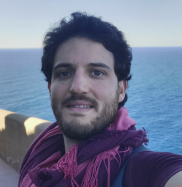

# [About me](/about)

I am a doctoral researcher interested in numerical relativity and cosmology. I study topics of the early Universe such as inflation and possible observables from primordial black holes, cosmic strings, and more. Most of my work is performing numerical simulations, where I use the GRChombo code and I contribute to its development and maintenance.

I enjoy a FNRS-FRIA grant to do my research at UCLouvain, [CURL](https://curl.group) in Belgium.

I am also very passionate about neuroscience. I the past, I have worked for the [INM-6](https://www.fz-juelich.de/inm/inm-6/EN/Home/home_node_INM6.html) at the Juelich Research Center. The collaboration is still ongoing, I am part of the Active vision project.

You can find my research and codes in [GitHub](https://github.com/cjoana).

I am also a Chess enthusiast and I usually play in [Chess.com](https://www.chess.com/member/cjoana). 

### Research

I have a wide range of interdisciplinary research interests. These reflect some of my latest publications:

- **Cosmology**: Early universe, inflation; primordial black holes.
- **General Relativity**: Hydro-GR codes; backreations, compact objects & topological defects.
- **Quantum Mechanics**: Quantum open systems; decoherence; exciton-polaritons.

- **Visual Neuroscience**: Perception; active vision; ventral visual pathway; predictive coding.
- **Systems Neurosciecne**: Neural coding, information processing; electrophysiology;
- **Computational Neuroscience**: Neural networks codes, NEST; Statistical and data analysis; 

 <!-- /.inforow -->

---

<h4 style="margin-top: 0.2em; margin-bottom: 0.0em;"> Notes </h4>

- Thesis (soon)

#### Current Teaching

- [Tutorial of Quantum mechanics II](https://uclouvain.be/en-cours-2021-lphys1342)

#### Past Teaching

- [Tutorial of Quantum mechanics II](https://uclouvain.be/en-cours-2019-lphys1342)

- [Introduction to Computational Neuroscience](https://www.campus.rwth-aachen.de/rwth/all/abstractmodule.asp?gguid=0x792B4EBEDF13204790133F661F74473C&fieldgguid=0x6E27476F2282E446A1228419DDDB3892&tguid=0xEBB2D1C29613C04FBF47F82813B5A4E9)
- [Theoretical Neuroscience](https://www.campus.rwth-aachen.de/rwth/all/abstractmodule.asp?objgguid=0xCFA5A28AEF56A9419F5430D5A03AB043&object=event&gguid=0x21ECCFFBBC4BDE41AF97A38C435E6761&fieldgguid=&tguid=0xEBB2D1C29613C04FBF47F82813B5A4E9)

<h4 style="margin-top: 0.2em; margin-bottom: 0.0em;"> Collaborations</h4>

- [GRChombo Team](https://www.grchombo.org/)
- [LISA](https://www.elisascience.org/)

- [Active Vision](https://www.fz-juelich.de/inm/inm-6/EN/Forschung/Gruen/ActiveVision.html?nn=724916)
- [Elephant](http://neuralensemble.org/elephant)
- [NEST](https://www.nest-simulator.org/)

<h4 style="margin-top: 0.2em; margin-bottom: 0.0em;"> PhD collaborators </h4>

- [Christian Keup](https://www.fz-juelich.de/SharedDocs/Personen/INM/INM-6/EN/staff/Keup_Christian.html?nn=724694) (Juelich)

<h4 style="margin-top: 0.2em; margin-bottom: 0.0em;"> Senior collaborators </h4>

- [Sebastien Clesse](https://curl.group/members/clesse.html) (UCLovain-CURL)
- [Christophe Ringeval](https://curl.group/members/chris.html) (UCLouvain-CURL)
- [Julien Lesgourgues](https://lesgourg.github.io/presentation.html) (RWTH-Aachen)
- [Junji Ito](https://www.fz-juelich.de/SharedDocs/Personen/INM/INM-6/EN/staff/Ito_Junji.html?nn=724694) (Juelich)
- [Sonja Gruen](https://www.fz-juelich.de/SharedDocs/Personen/INM/INM-6/EN/staff/Gruen_Sonja.html?nn=724694) (Juelich)
- [Pedro Maldonado](https://www.bni.cl/investigador.php?id=13) (Univ. Chile)
- [Tim Byrnes](https://nyu.timbyrnes.net/) (NYU Shanghai)

 <!-- /.inforow -->

## Recent publications & blog posts


   
	
   


<!-- /.tiles -->

#### For more posts see [publications](/articles) and [other posts](/projects).

